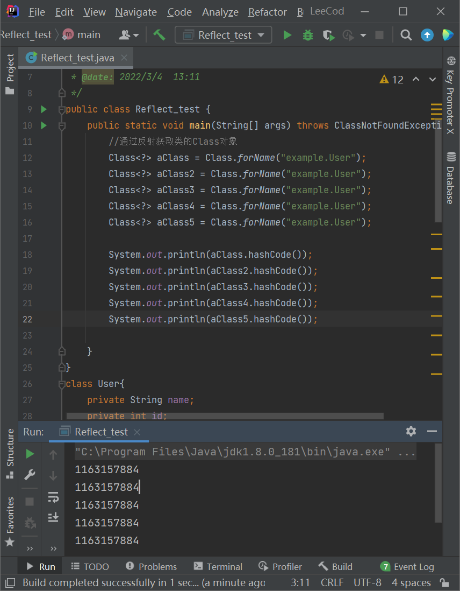
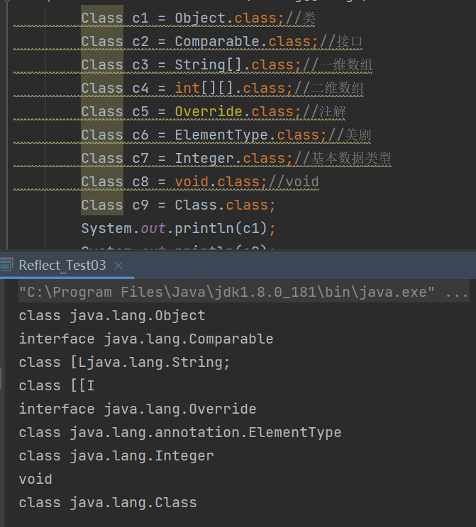
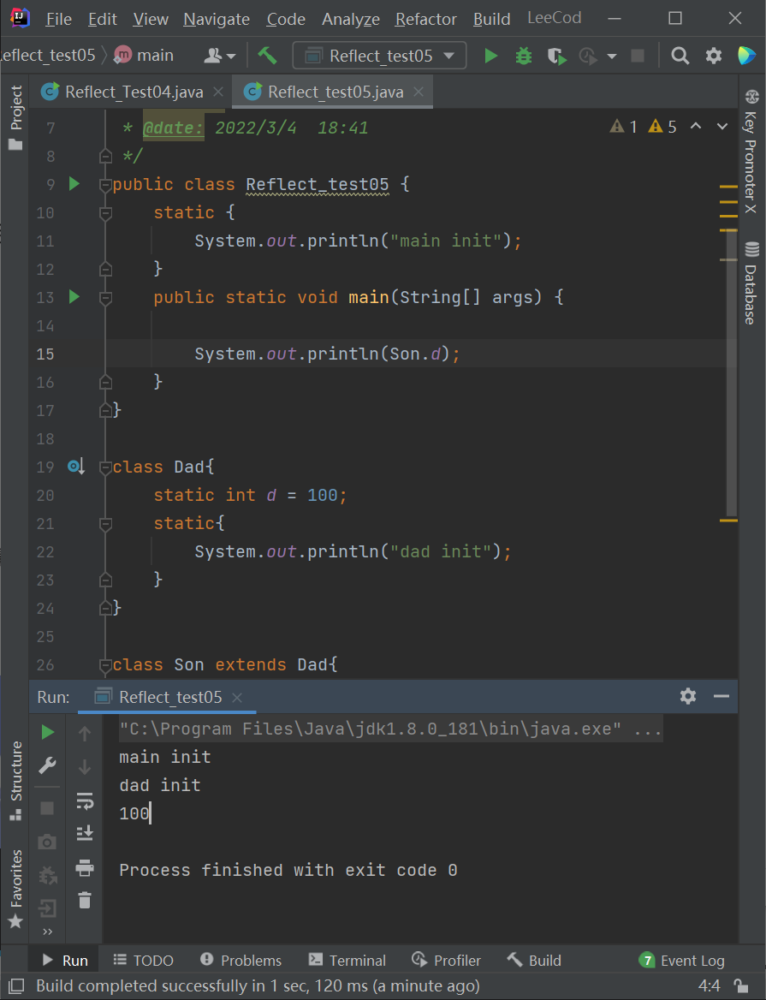
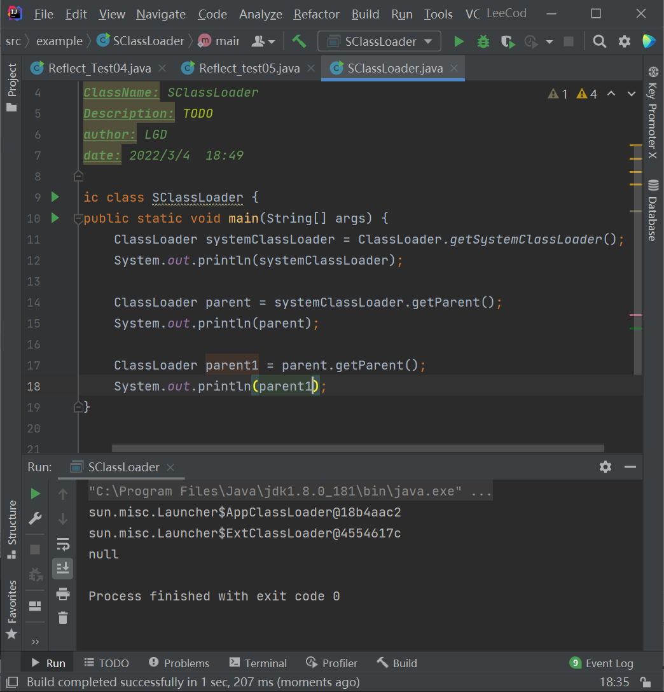

# 注解与反射

Annotation 注解

注释

注解为JDK5.0开始引入的技术

#### 作用：

- 不是程序本身，而是对程序作出解释

- 可以被其他程序（编译器）读取

- 格式一般是@xxx，如@AutoWired，@Override重写，stop,destroy有@Deprecated表明其已被废弃不被使用

- 它还可以添加一些参数值，如@SuppressWarings(value="unchecked")

  也可以附加在package, class, method ,field等上面，相当于添加额外的辅助信息

了解内置注解

java.lang.Override:重写注解的声明

@Deprecated，已经过时的声明，不推荐使用

@SuppressWarnings（"all"）,镇压警告

#### 元注解：

负责解释其他注解的注解，有四个meta-annotation

- @Target(描述可以使用的范围)
- @Retention(表示在什么级别保存Source<Class<Runtime)
- @Documented
- @Inherited

#### 测试元注解：

```java
@Target(value = {ElementType.METHOD,ElementType.TYPE})//方法上,作用域
@Retention(value = RetentionPolicy.RUNTIME)//表示注解在什么地方还有效runtime>class>sources
@Document//表示是否将我们的注解生成在JavaDoc中
@Inherited//子类可以继承父类的注解
@interface MyAnnnotation{
    
}
```

#### 自定义注解

使用@interface,自动继承java.lang.annotation.Annotation接口

```java
@Target({ElementTYpe.TYPE,ElementType.METHOD})
@Retention(RetetionPolicy.RUNTIME)
@interface MyAnnotation2{
    //注解的参数 : 参数类型 + 参数名 ();
    String name() default "";
    int age() default 0;
    int id() default -1;
    
    String[] schools() default {"ZJU","ZUST"};
}
```

使用

```java
 @MyAnnotation2(age = 20, name = "lgd")
 public void test(){}
```

注解是通过反射实现的

### 反射

#### 静态VS动态语言

动态语言：运行时可以改变其结构的语言，如JS，PHP


静态语言：Java,C,C++结构不可变

反射让Java可以从静态语言变成“动态语言”

允许程序在执行期间获取任何类内部信息并直接操作其内部属性及方法。

Class c = Class.forName("java.lang.String")

加载完类后，在堆内存方法区中会产生一个Class类型对象，这个对象含有这个完整类的结构信息，我们可以通过这个对象看到类的内部信息与结构，所以称之为**反射**。Object也有个getClass()

具体为 public final Class getClass();

#### 优点：

就是可以动态创建对象并编译，很灵活，因为他是可以在程序跑起来以后再操作的

#### 缺点：

因为他是一种解释操作，告诉JVM我们想干什么，所以会慢于直接执行的操作。（好几十倍）

#### 相关API:

- java.lang.Class：一个类

- java.lang.reflect.Method：方法
- java.lang.reflect.Field：成员变量
- java.lang.reflect.Constructor:构造器

一个类在内存中只有一个Class对象，一个类被加载后，整个结构都被封装在Class对象中



### Class类

- 本身也是一个类
- 只能由系统建立对象
- 一个加载类在JVM中只有一个Class实例
- 通过Class完整地得到类所有结构

#### 常用方法：

- static ClassforName(String name)——返回指定类名的Class对象
- newInstacne()——调用缺省构造函数
- getName()——此对象表示实体的名称
- getSuperClass()——父类Class对象
- getinterfaces()——当前Class对象的接口
- getClassLoader()——类加载器
- getConstructors()——Constructor对象数组
- getMethod(String name,Class.. T)——
- getDeclaredFields()——

#### 获取Class实例

- xxx.class
- xxx.getClass();
- Class.getForName("xxx.xx.xx")


#### 哪些类型有Class对象

- class
- interface
- Array
- enum
- annotation
- primitive type:基本数据类型
- void



只要元素类型与维度一样，就是同一个Class

### Java内存

- 堆
  - 存放new的对象与数组
  - 可以被所有线程共享，不会存放别的对象引用
- 栈
  - 存放基本变量类型(含具体数值)
  - 引用对象的变量(含在堆中的具体地址)
- 方法区
  - 可以被所有线程共享
  - 包含所有的class和static变量

##### 类加载器Load:

class文件读入内存，并创建一个java.lang.Class

##### 类的链接Link:

类的二进制数据合并到JRE中

1. 验证，确保符合jvm规范
2. 为static分配内存并设置类变量默认初始值，这些内存在方法去中进行分配
3. 解析：虚拟机常量池内的符号引用替换为直接引用

##### 类初始化Initialize

jvm负责对类进行初始化

1. 执行类构造器<clinit>()方法的过程。类构造器<clinit>()方法是由编译期自动收集类中所有类变量的复制动作和静态代码块中的语句合并产生的
2. 当初始化一个类时，如果发现其父类没有初始化则先初始化其父类
3. jvm会保证每个类<clint>()在多线程环境中被正确加锁与同步

类的主动引用：（会发生类初始化）

- 虚拟器启动，初始化main方法所在类
- new一个类对象
- 调用类的静态成员及方法
- 使用反射包对类反射调用
- 初始化一个类时，其父类未初始化则先初始化父类

类的被动引用

- 访问一个静态域时，需要先声明这个域的类（比如通过子类访问父类的静态变量，不会导致子类初始化）

  

- 引用常量不会触发（常量在链接link时就存入调用类的常量池中）

总之：按需初始化，需要这个类时才会初始化这个类

### 类加载器

- 引导类加载器：负责核心库rt，C++写的
- 扩展类加载器：jre/lib/ext
- 系统类加载器：最常用



双亲委派机制——一层一层向上找如果根加载jar包里有，他会用原来的而不会用你的包以保证核心类不被破坏

*.java-->编译器-->*.class-->Loader-->字节码校验器-->解释器-->操作系统平台

类缓存：一旦某个类被加载到类加载器中，他会缓存一段时间，JVM回收机制可以回收这些Class对象

